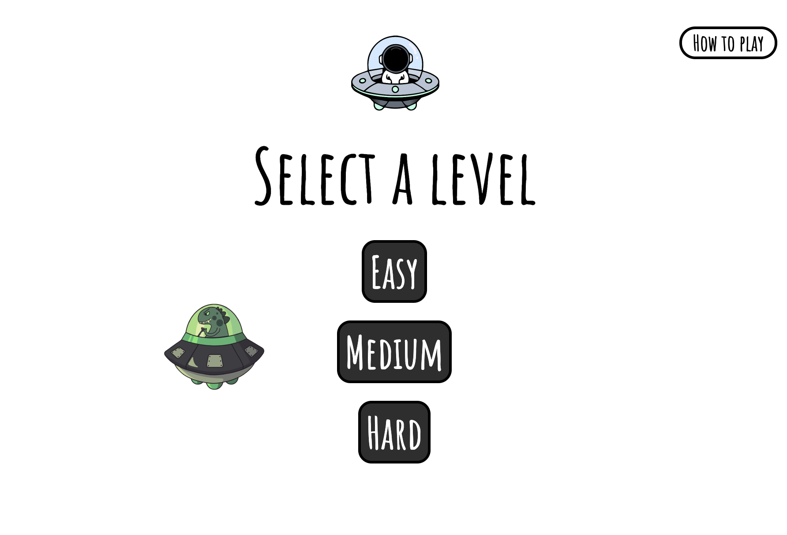

<h1>Galactic Chase</h1>
<i>by Luis</i>

 
 
 
This is my first Ironhack's course project. Galactic Chase is a simple videogame created applying everything learnt in the first module.
 
 

This is a videogame about an astronaut in his little ship fighting against a UFO. The UFO grows everytime you move, your <b>mission</b> is to not let him grow by shooting at him.
 
 
These are the instructions:
<ul>
<li>1. The UFO grows everytime you move.</li>
<li>1. The blue and pink waves get on to let you know you can shoot.</li>
<li>2. When you shoot at the UFO, he will shrink.</li>
<li>3. You can only shoot when you are over him.</li>
<li>4. If you go over the shooting star, you get special powers and will be able to shoot even if you are not close to the UFO.</li>
<li>5. Don't shoot when the UFO's green light is on as every bullet will make him bigger instead.</li>
</ul>
 
<h2>Page sections</h2>

This is the landing page. When you click on the start button, it will take you to the Levels section.
 
 
 

This is the Levels section where you can select the 3 different level modes. You can also access the instructions in this section by clicking on the question mark on the top-right corner.
 
 
 

This is the Game Area, you can exit by clicking the X on the bottom-right corner.
 
<h2>Responsive</h2>
The page is fully responsive although you cannot play the videogame without a keyboard for now. The sections and the game area will adjust to any screen size. If the window width is not greater than 1000px you will get a message suggesting to enter full screen.
